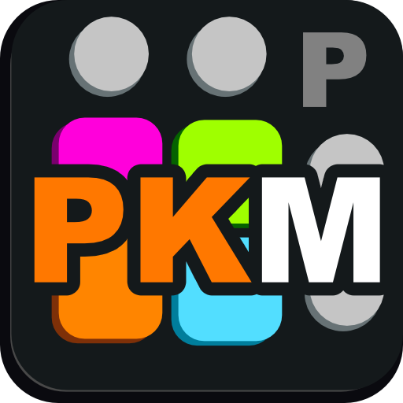
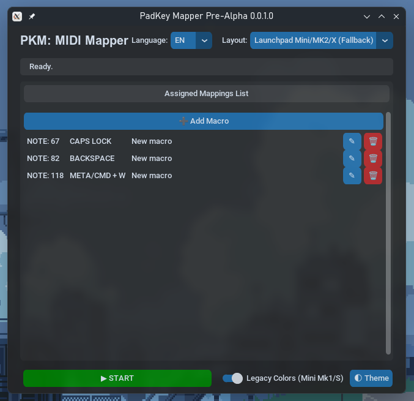
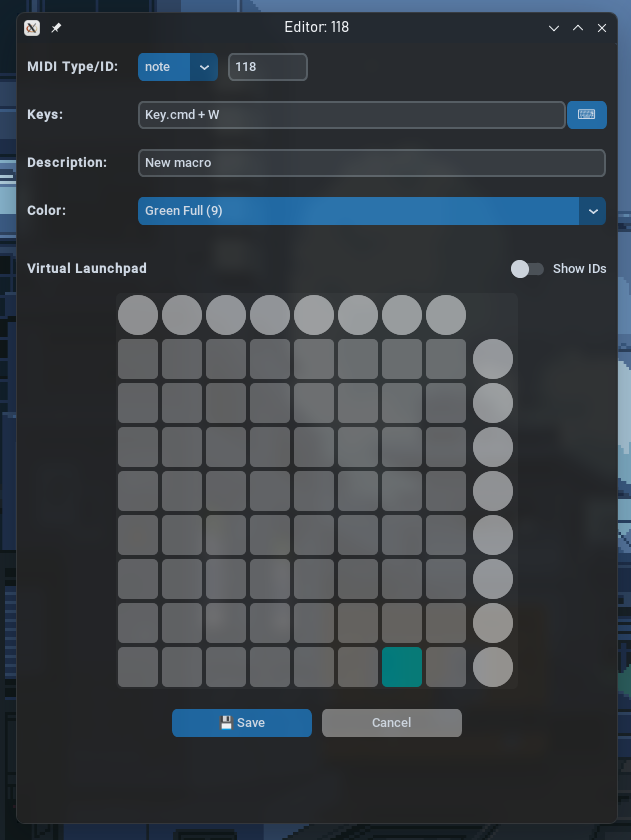
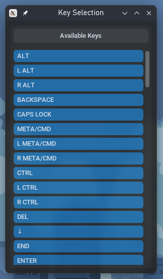

# PadKey Mapper | PKM

  

**PadKey Mapper** turns your Novation Launchpad (Mini, MK2, X, Pro) into a powerful, customizable macro keyboard for Linux.



Map any button on your Launchpad to keyboard shortcuts (Ctrl+C, Ctrl+V, etc), function keys (F1-F12), or media controls using a modern, easy-to-use GUI.





## ✨ Features
- **Graphic Interface:** No config files editing needed—assign keys visually.
- **Visual Feedback:** Assigned pads light up.
- **Multiple Layouts:** Support for Mini, MK2, X, and Pro models. (Not sure for latest models)
- **Native Arch Linux package:** You can just install it via pacman -U! Or build from sources using PKGBUILD.
- **AppImage:** Runs on almost any Linux distribution.
- **Low Latency:** Uses native Linux `uinput` kernel module.

## 🚀 Quick Start

1. **Download** the latest PadKeyMapper `.AppImage` from Releases.
2. **Setup Permissions** (Required for uinput):
    ```bash
    curl -sL https://raw.githubusercontent.com/Y-Akamirsky/PadKeyMapper/refs/heads/main/install_uinput.sh | bash
    ```
    **Note:** Applying changes may require reboot/logout
3. **Run:**
    ```bash
    cd ~/directory/of/your/PadKeyMapper-{version}-x86-64.AppImage # Change to your actual directory and version!!!
    chmod +x PadKeyMapper-{version}-x86-64.AppImage # Change {version} to actual package version!!!
    cd
    ```

## 📚 Documentation
- 🇬🇧 **English:**
  - [Installation Guide](docs/INSTALL_EN.md)
  - [User Manual](docs/USAGE_EN.md)
  - [Changelog & Known Issues](docs/INFO_EN.md)

- 🇷🇺 **Русский:**
  - [Инструкция по установке](docs/INSTALL_RU.md)
  - [Руководство пользователя](docs/USAGE_RU.md)
  - [История изменений и ошибки](docs/INFO_RU.md)

## 🤝 Contributing
Pull requests are welcome! For major changes, please open an issue first to discuss what you would like to change.

## 🛠 Built With

    - Python 3

    - CustomTkinter

    - python-uinput

    - Mido / RtMidi
